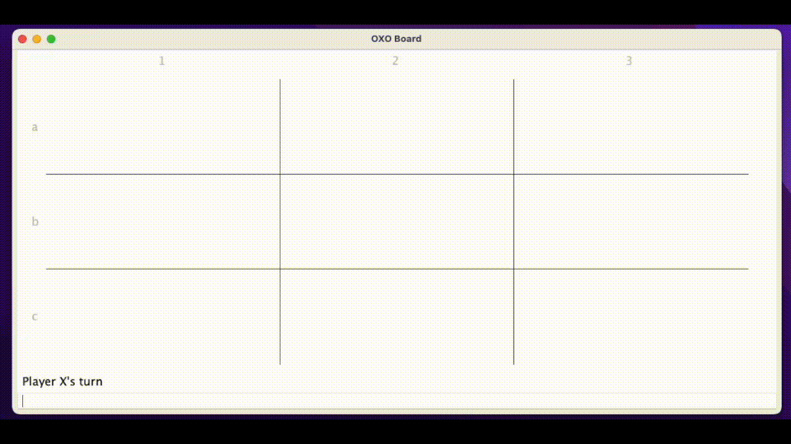

<h1 align="center">
  <br>
    </a>
  <br>
  OXO
  <br>
</h1>

<h4 align="center">A digital version of the classic turn-taking game "Noughts and Crosses"  built in Java.</h4>

<p align="center">
  <a href="#Features">Key Features</a> |
  <a href="#Usage">Usage</a> |
  <a href="#Design">Design</a> |
  <a href="#License">License</a>
</p>

<p align="center">

</p>

# Key Features

- Fully customisable asymmetrical grids (3x3 upto 9x9)
- Fully customisable win thresholds
- Exceptions for invalid moves

# Usage
The game supports Java 8+ and can be run using IntelliJ. The game can be launched from the OXOGameClass.

# Design
The game adopts the MVC (Model View Controller) architecture.

The OXOModel class contains the core data structures for the game - the public methods provided by this class are used to manipulate the internal state of the game.

The OXOView class is responsible for the "Rendering Logic" - any changes to the state of the OXOModel will be automatically rendered in the OXOView.

The OXOController class handles all of the event handling logic in the game.

The OXO Tester class contains all of the unit tests written for the application.  

# License
```
Copyright (c) 2021 Keane Fernandes

Permission is hereby granted, free of charge, to any person obtaining a copy
of this software and associated documentation files (the "Software"), to deal
in the Software without restriction, including without limitation the rights
to use, copy, modify, merge, publish, distribute, sublicense, and/or sell
copies of the Software, and to permit persons to whom the Software is
furnished to do so, subject to the following conditions:

The above copyright notice and this permission notice shall be included in all
copies or substantial portions of the Software.

THE SOFTWARE IS PROVIDED "AS IS", WITHOUT WARRANTY OF ANY KIND, EXPRESS OR
IMPLIED, INCLUDING BUT NOT LIMITED TO THE WARRANTIES OF MERCHANTABILITY,
FITNESS FOR A PARTICULAR PURPOSE AND NONINFRINGEMENT. IN NO EVENT SHALL THE
AUTHORS OR COPYRIGHT HOLDERS BE LIABLE FOR ANY CLAIM, DAMAGES OR OTHER
LIABILITY, WHETHER IN AN ACTION OF CONTRACT, TORT OR OTHERWISE, ARISING FROM,
OUT OF OR IN CONNECTION WITH THE SOFTWARE OR THE USE OR OTHER DEALINGS IN THE
SOFTWARE.
```