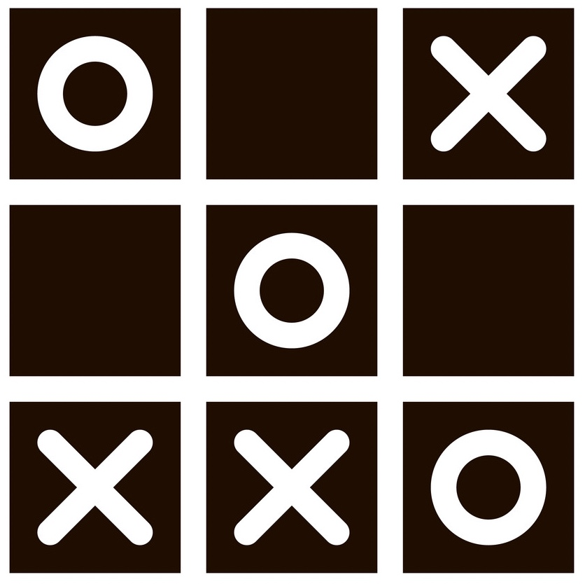

# Overview Keane
---
This is a digital version of the classic turn-taking game "Noughts and Crosses" (OXO) that is built using the MVC (Model View Controller) design pattern.

The key features of this board are:
- Fully customisable grid - supports an 3x3 grid all the way upto a 9x9

The OXOModel class contains the core data structures for the game - the public methods provided by this class are used to manipulate the internal state of the game.

The OXOController class handles all of the event handling logic in the game.

The OXOView class is responsible for the "Rendering Logic" - any changes to the state of the OXOModel will be automatically rendered in the OXOView.

The game can be launched from the OXOGameClass.

# Installation

# Usage